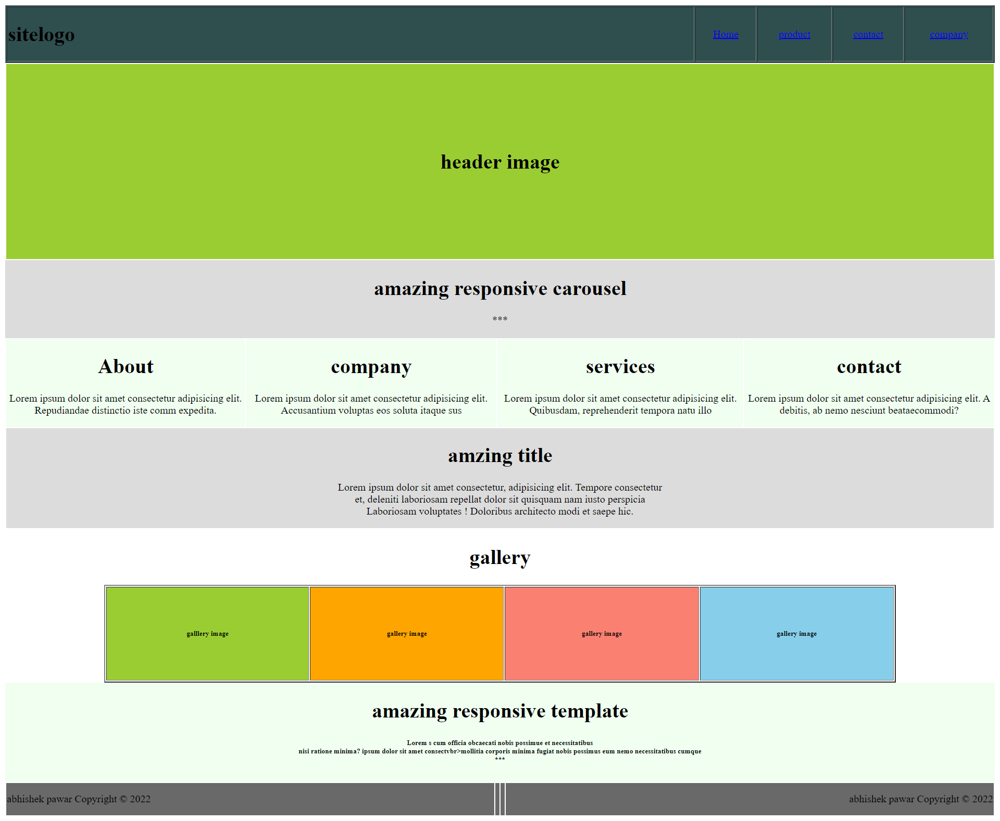
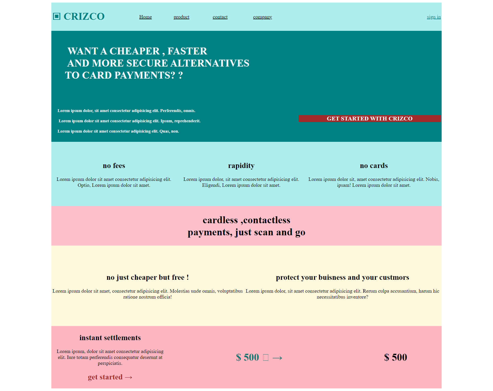
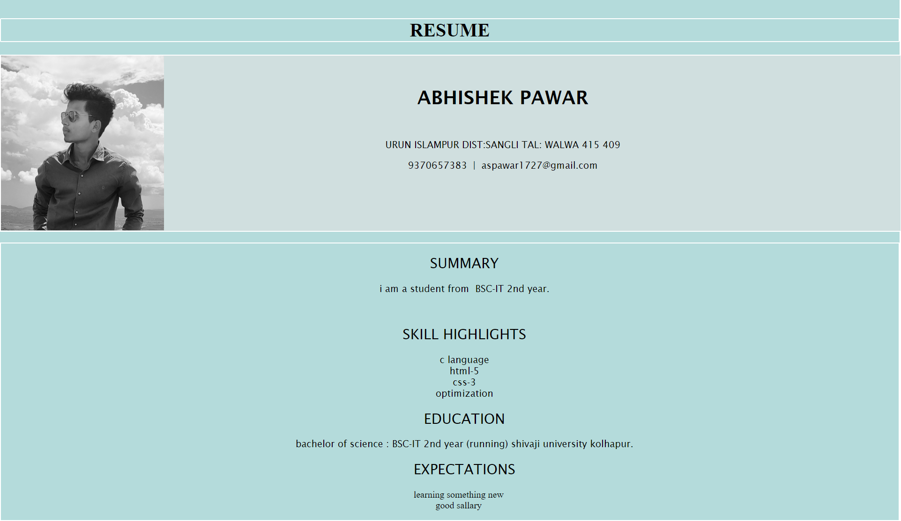

# tasks by abhi

## task_1

## task_2

## task_3

## task_4

## task_5

## task_6

## task_7

## task_8

## task 10

## task_11

## TASK_12

## practice

## task_14

## task_15

## task_16

## task_17

## task_18

=======
